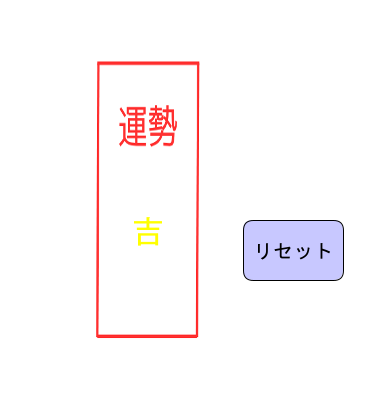
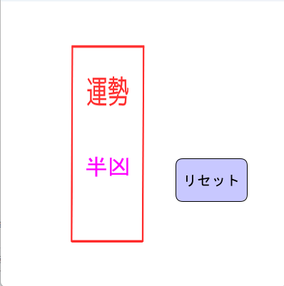

# 課題タイトル
今日の運勢

---

## 学籍番号・氏名
- 学籍番号：2501002
- 氏名：上野悠汰

---

## 課題概要
ボタンを押したらランダムに運勢を表示できる課題です。

---

## 使用技術・ライブラリ
- 使用言語：Processing (Java)
- 使用ライブラリ：
  なし

---

## 制作の工夫ポイント
- 実装や表現で工夫した点：
  - ボタンの配置を分けて押したときに結果が出なくならないにようにした。
  - 結果の割合をランダムだと確率が一緒なため、確率を定めた。

---

## 難しかった点・学んだこと
- 実装で苦労したこと：
  画像やボタンの配置、色の配色などの設定が難しかった。 
- この課題を通して学んだこと：
  配置の重要性

---

## 今後の改善・発展アイデア
- 次に取り組むとしたら改善したい点：
  大吉や大凶などに演出を追加したい。
  運勢だけでなく、内容も表示できるようにしたい。
- 発展アイデアや追加機能：
  別のパターンのおみくじもできるようにしたい。
  (恋みくじや金運みくじ、仕事みくじなど)

---

## 実行方法
- Processingで開く場合：
  1. `sketchフォルダ` を開く
  2. `Today_Lucky.pde` を開き「実行」ボタンを押す。
- 注意点や素材の配置など：
  画像は全て同じフォルダ内に入れてください。
---

## スクリーンショット / GIF

